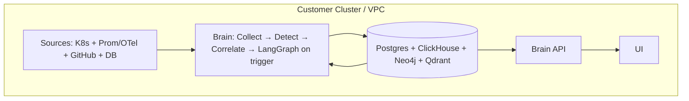
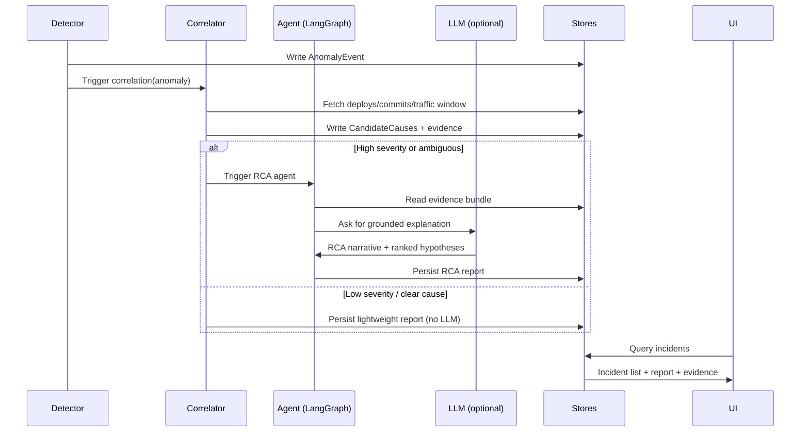

# Architecture (Summary)

This project builds a Kubernetes-first RCA system that correlates **production pain** (RED metrics + resource saturation) with **recent change** (deployments, config, commits) and produces an evidence-backed report.

## What we’re optimizing for

- Fast time-to-value (works with metrics + deploy events + git)
- Privacy by default (Brain runs inside the customer environment)
- Bounded LLM cost (LLM only runs when a trigger fires)
- Evidence-first output (confidence + supporting data)

## Two-part product

### 1) Brain (customer-installed)

Runs in-cluster (Helm) or in the same VPC.

Responsibilities:

- Ingest signals (infra, code, DB)
- Detect anomalies and open incidents
- Correlate incidents with deployments/commits/config
- Run the RCA agent (LangGraph) only when approved
- Persist incidents + evidence + reports
- Expose an API for the UI

### 2) UI (hosted or self-hosted)

Responsibilities:

- Incident list + status (open/triaged/resolved)
- Ranked hypotheses (traffic vs release vs dependency vs DB)
- “What changed?” view (deploy + commits + config changes)
- Evidence view (charts + timeline + confidence)

## Data stores (the 4-database model)

| DB         | Type       | Used for                                                                                   |
| ---------- | ---------- | ------------------------------------------------------------------------------------------ |
| Neo4j      | Graph      | Topology + relationships: Service → Dependency → DB, Deploy → Commit → Service             |
| ClickHouse | Columnar   | High-volume metrics/features: p99, error rate, CPU/mem, traffic, derived anomaly features  |
| Qdrant     | Vector     | Embeddings: git diffs/PRs, runbooks, incident summaries (semantic retrieval)               |
| PostgreSQL | Relational | App state: incidents, trigger decisions, settings, user accounts (later), report artifacts |

## Ingestion (two versions)

### Version 1 (MVP): no Kafka, no Debezium

Goal: simple install, near-real-time, covers the common “deploy caused regression” cases.

- Infra stream: Prometheus queries (10–30s) and/or OTel if already present
- Code stream: K8s watch (Deployments/Pods) + GitHub webhooks (polling fallback)
- DB stream: periodic schema snapshots (`information_schema`) + optional DB stats polling

### Version 2 (Production): Kafka/Redpanda + Debezium

Goal: event-driven ingestion with buffering/backpressure and real CDC.

- Infra stream: OTel metrics/traces → broker → ClickHouse
- Code stream: K8s controller + GitHub webhooks → broker → stores
- DB stream: Debezium CDC → broker → consumers

## Triggering (LLM cost control)

### Default trigger (RED + change proximity)

Open an incident candidate when:

- 5xx error rate > 1% OR p99 latency > 2× baseline
- AND it occurs within 15 minutes of a DeploymentEvent for the service

### Three-tier gating

1. Tier 1: Sentinel (deterministic)
   - Prometheus alert rules and/or ClickHouse aggregate queries
   - Output: TriggerCandidate

2. Tier 2: Filter (cheap heuristics, no LLM)
   - Checks: deploy correlation, persistence, traffic floor, known-flaky suppression, rate limits
   - Output: ApprovedIncident (or suppressed with reason)

3. Tier 3: Investigator (LangGraph + LLM)
   - Runs only for approved incidents
   - Produces: ranked hypotheses + narrative + remediation ideas + evidence references

## End-to-end flow (concept)



## What we implement first

1. Sentinel + Filter (Tier 1/2): write incidents/decisions into PostgreSQL
2. K8s deploy watcher: map Deployment → image tag → commit SHA (best effort)
3. ClickHouse metrics schema: store p99/error-rate/CPU/mem + anomaly window features
4. Investigator skeleton: LangGraph that retrieves evidence and generates a report

---

## Reference architecture

```mermaid
graph TB
  subgraph CustomerEnv[Customer VPC / Cluster]
    subgraph Sources[Data Sources]
      K8S[Kubernetes API]
      PROM[Prometheus]
      MESH[Service Mesh Metrics]
      DB[(Database)]
      GIT[GitHub / Git]
    end

    subgraph Brain[Brain: RCA Engine]
      COL[Collectors
      - K8s events
      - Prometheus queries
      - Git/PR fetch
      - DB stats]

      NORM[Normalizer
      - canonical events
      - service identity]

      STORE[(Stores
      - PostgreSQL (incidents/config)
      - ClickHouse (metrics/features)
      - Qdrant (embeddings)
      - Neo4j (topology/relations))]

      DET[Anomaly Detector
      (cheap always-on)]

      CORR[Correlator
      (deploy↔metric↔commit)]

      ORCH[Agent Orchestrator
      (LangGraph)]

      LLM[LLM Provider
      (optional / pluggable)]

      API[Brain API
      (REST/GraphQL)]
    end

    UI[UI Web App
    (self-hosted or hosted)]
  end

  K8S --> COL
  PROM --> COL
  MESH --> COL
  DB --> COL
  GIT --> COL

  COL --> NORM --> STORE
  STORE --> DET
  DET --> CORR
  CORR --> ORCH
  ORCH --> LLM
  ORCH --> STORE
  STORE --> API
  API --> UI
```

---

## Incident lifecycle (triggered analysis)



---

## Brain internals (modules)

### Collectors

- `k8s_collector`: watches Deployments/ReplicaSets/Pods/Events
- `prometheus_collector`: queries SLO/SLA metrics per service
- `git_collector`: fetches commits/PR metadata (webhook-first, polling fallback)
- `db_collector`: fetches DB stats (optional v0)

### Data model (conceptual)

- `Service`: stable identity for a logical service (namespace + labels)
- `DeploymentEvent`: rollout start/end, image tags, helm release, etc.
- `Commit`: hash, repo, files touched, diff summary, PR link
- `AnomalyEvent`: metric, baseline, deviation, window
- `Evidence`: charts/snapshots, correlated events, diffs summaries
- `RCAReport`: hypotheses ranked, confidence, narrative, suggested actions

### Storage options (choose based on simplicity)

For this project we standardize on the following stores:

- **PostgreSQL**: incidents, evidence pointers, settings, rules, multi-tenant state
- **ClickHouse**: metric events + aggregates + anomaly features (high volume)
- **Qdrant**: embeddings for diffs/PRs/runbooks/incidents
- **Neo4j**: service topology + deploy/commit relationships

---

## UI responsibilities (what it should show)

- Incident timeline (deploys, anomalies, traffic shifts)
- Ranked causes:
  - “Most likely caused by release X” (confidence)
  - “Traffic spike detected; capacity insufficient” (confidence)
  - “Downstream dependency latency increased” (confidence)
- Code impact:
  - top commits/PRs with file list and summarized diffs
  - explanation of suspected mechanism (e.g., N+1 query, cache miss storm)
- Evidence:
  - charts (CPU/mem, latency/error rate, request rate)
  - correlation window and rationale

---

## Security / privacy baseline

- Brain runs in customer environment; data stays local by default
- Secrets stored as K8s Secrets; support external secret managers later
- Optional outbound-only to LLM provider; allow local model alternative
- RBAC for Brain API + UI

---

## Next design decisions (we should lock these in early)

1. **Deployment model**: Helm chart for in-cluster install (recommended)
2. **Data plane stores**: Postgres + ClickHouse + Qdrant + Neo4j (define minimal schemas)
3. **Identity mapping**: how we map “service” ↔ repo ↔ deploy artifact
4. **Triggering policy**: severity thresholds + persistence window + rate limits
5. **LLM strategy**: pluggable providers + caching + strict grounding

See also:

- Data models: [DATA_MODELS.md](../data_structure/DATA_MODELS.md)
- Identity mapping: [IDENTITY_MAPPING.md](../data_gathering/IDENTITY_MAPPING.md)
