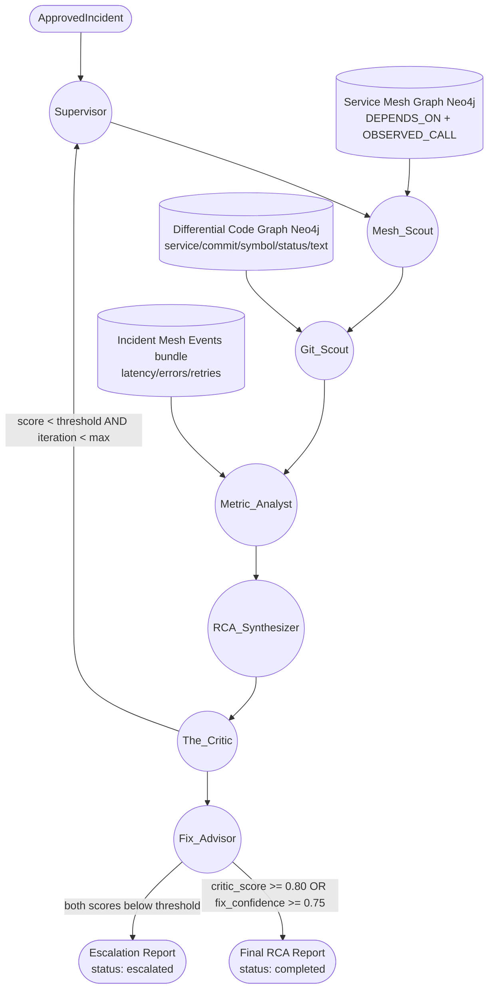

# Brain (RCA Engine)

The Brain is the customer-installed RCA engine that runs only when a trigger fires. It follows a Supervisor-Worker-Critic pattern and keeps every conclusion tied to concrete evidence.

## MVP execution

```python
from datetime import datetime, timezone

from rca.brain import ApprovedIncident, BrainEngine, BrainEngineConfig

incident = ApprovedIncident(
    incident_id="inc-123",
    service="checkout-api",
    started_at=datetime(2026, 2, 22, tzinfo=timezone.utc),
    deployment_id="deploy-42",
)

# Basic (no mesh DB, no code graph)
engine = BrainEngine()
report = engine.run(incident)
print(report.status, report.critic_score, report.fix_confidence)

# Optional: pass a repo graph index and a mesh Neo4j driver to enable
# dependency-aware service prioritization before Git_Scout runs.
#
# from neo4j import GraphDatabase
# mesh_driver = GraphDatabase.driver("bolt://localhost:7688", auth=("neo4j", "password"))
# engine = BrainEngine(config=BrainEngineConfig(graph_index=repo_graph_index, mesh_driver=mesh_driver))
# report = engine.run(incident)
# mesh_driver.close()
```

## Architecture diagram



## Node responsibilities

### 1) Supervisor (orchestrator)

- Inputs: incident metadata and previous loop feedback.
- Decides which workers run next and in what order.
- Builds the investigation plan for the current iteration.
- Routes low-confidence investigations back into another evidence-gathering loop.

Operational detail:

- Maintains investigation scope as a set of suspect services, initially containing only the triggered service.
- Expands scope when `Mesh_Scout` and/or `Metric_Analyst` report upstream/downstream degradation (blast-radius expansion).
- Issues worker tasks with explicit constraints:
  - time window (`incident_started_at ± lookback/lookahead`)
  - services in scope
  - evidence still missing (logs, commits, mesh edges, deployment linkage)

### 2) Mesh_Scout (dependency scope worker)

- Primary job: decide which services to prioritise for code-change lookup.
- Traverses the service mesh _graph_ (Neo4j) starting at the triggered service.
- Ranks upstream suspects using observed degradation (error/latency) when available.
- Populates `suspect_services` before `Git_Scout` runs.

Operational detail:

- Uses two relationship types in the mesh graph:
  - `DEPENDS_ON`: static topology from architecture ("this service calls that service")
  - `OBSERVED_CALL`: aggregated live stats from the incident window (call/error/latency)
- Traversal:
  - follows `DEPENDS_ON` up to a small depth (default 2 hops)
  - joins `OBSERVED_CALL` from the triggered service to score direct upstream degradation
- Fallback: if no mesh DB driver is configured, derives suspects from the incident bundle's `mesh_events_jsonl`.

### 3) Metric_Analyst (runtime behavior worker)

- Reads runtime signals (RED metrics, saturation, dependency errors).
- Uses raw incident evidence (logs + mesh call events) to identify degraded upstream calls when needed.
- Characterizes anomaly shape (step change, gradual creep, intermittent spikes).
- Produces structured metric findings and evidence references.

Operational detail:

- Consumes raw incident evidence (logs + `mesh_events_jsonl`) and characterises the anomaly.
- If `Mesh_Scout` already expanded scope, `Metric_Analyst` focuses on describing the anomaly pattern rather than re-deciding scope.

### 4) Git_Scout (code-change worker)

- Looks up pre-indexed code-change evidence from the differential graph.
- Queries by service, deployment, commit window, and relevant change categories.
- Uses node status and node text to report what changed:
  - `MODIFIED` nodes: patch lines (old/new evidence)
  - `ADDED` nodes: current source for the added range
  - `UNCHANGED` nodes: structure-only context
- Returns ranked code evidence with traceable commit/file/symbol metadata.

Operational detail (how DB query works):

- Query dimensions (all are used together, not independently):
  - service (single service or set of suspect services)
  - time window around incident start
  - deployment identifier(s) when available
  - status filter (`MODIFIED`, `ADDED`; optionally `DELETED`)
  - change-category hints (timeouts, retries, db, network, config)
- Retrieval strategy:
  1. Query the differential graph for each service in `suspect_services`.
  2. Prefer nodes with `status:(MODIFIED OR ADDED)` and deployment context when present.
  3. Return top evidence items with file, symbol, status, and text patch.
- Important behavior: `Git_Scout` should be run after `Mesh_Scout` so it searches likely upstream services even when the triggered service has no commits.

### 5) RCA_Synthesizer (reasoning worker)

- Combines metric findings and code-change findings.
- Produces ranked hypotheses with explicit evidence links.
- Estimates confidence and highlights the strongest causal chain.
- Surfaces missing evidence that would materially change confidence.

Operational detail:

- Merges three evidence classes into one causal chain:
  - runtime behavior (mesh/metrics/logs)
  - code/config deltas
  - temporal ordering (what changed before symptoms started)
- Produces service-to-service causal statements, e.g.:
  - Order service degraded because Payment service timeout/retry behavior changed.

### 6) The_Critic (validation worker)

- Attempts to disprove the top hypothesis.
- Checks timeline consistency, alternative causes, and evidence quality.
- Scores causal certainty as `critic_score` — how well the evidence proves the exact root cause.
- Decides whether to loop for more evidence or proceed to `Fix_Advisor`.

Operational detail:

- Rejects hypotheses that only match correlation but fail sequence checks.
- Forces broadening when evidence only covers one service in a multi-service failure pattern.
- Requires at least one concrete runtime signal and one concrete change signal for the blamed service.
- `critic_score` deliberately measures the strength of _causal proof_, not the validity of the fix. A low score (e.g. 0.30) is expected when multiple plausible causes produce the same symptoms — `Fix_Advisor` handles actionability independently.

### 7) Fix_Advisor (remediation worker)

- Always runs once after the critic loop completes, whether the critic score was high or low.
- Asks: **"What single intervention resolves the incident regardless of which hypothesis is correct?"**
- Produces `fix_summary`, `fix_confidence`, and `fix_reasoning`.
- Scores actionability independently of causal certainty — the two scores serve different purposes.

Operational detail:

- Receives all ranked hypotheses, the top candidate's summary, and the critic's specific objections.
- Explicitly reasons across all plausible causes to find the _convergent remediation_: the fix that is safe and effective whether cause X or cause Y turns out to be true.
- Considers ownership: if the failing component is a third-party or external service, the fix targets the caller's configuration (timeouts, circuit breakers, rate limits) rather than requiring changes the team cannot make.
- `fix_confidence` guide:
  - `0.9+` — fix is clearly safe under all plausible causes
  - `0.7–0.89` — covers most cases with low risk
  - `< 0.7` — effectiveness depends on which hypothesis is true; manual review recommended
- Escalation gate: report resolves as `completed` when `critic_score >= 0.80 OR fix_confidence >= 0.75`. This prevents well-understood, actionable incidents from being unnecessarily escalated just because causal attribution is ambiguous.

## Data contracts used by the Brain

### Runtime graph (service mesh)

- Primary purpose: represent the dependency topology and overlay observed degradation.
- Consumed mainly by `Mesh_Scout`.

Relationship model:

- `DEPENDS_ON {type}`: static dependencies from `architecture.json`
- `OBSERVED_CALL {scenario_id, call_count, error_count, avg_latency_ms, p99_latency_ms}`: aggregated live stats

The incident bundle still carries raw call events (`mesh_events_jsonl`) for transparency/debugging and for fallback operation.

Traversal rules (typical):

- Seed node: triggered service.
- Expansion rule: follow `DEPENDS_ON` up to a small depth.
- Prioritisation: boost dependencies that have `OBSERVED_CALL` degradation (high error rate or latency).

### Differential code graph

- Primary purpose: explain what code/config changed near the anomaly window.
- Typical fields: service, commit SHA, file path, symbol, status, text, relationships.
- Consumed mainly by `Git_Scout`.

Node text policy (for evidence quality and cost):

- `MODIFIED`: patch lines (old/new) for changed range.
- `ADDED`: current source for added range.
- `UNCHANGED`: empty text (structure only).
- `DELETED`: empty text.

This keeps retrieval focused on what changed, not full-file noise.

## Cross-service incident handling (the scenario you described)

When Service A is impacted but Service B introduced the change, the Brain follows this workflow:

1. Trigger arrives for Service A.
2. `Mesh_Scout` traverses dependency topology from Service A and ranks upstream suspects using observed mesh degradation.
3. Brain adds Service B (and others) to suspect scope.
4. `Git_Scout` queries differential graph for each suspect service (including Service B).
5. `Metric_Analyst` characterises runtime anomaly pattern using incident evidence (logs + raw mesh events).
6. `RCA_Synthesizer` connects runtime degradation chain with code-change chain.
7. `The_Critic` verifies timeline and alternative explanations; may loop for more evidence.
8. `Fix_Advisor` determines the best remediation that holds across all remaining hypotheses, even if causal attribution is still ambiguous.

Result: ownership and impact can cross team boundaries; the Brain is dependency-aware and does not assume "affected service == changed service". Even when the exact cause cannot be proven (e.g. gateway slow _vs_ timeout config too tight), the Brain can still resolve the incident with a high-confidence fix.

## Git_Scout query template (conceptual)

Use this as the mental model for retrieval inputs:

- Services in scope: triggered service + mesh-discovered suspects
- Time bounds: from `incident_start - lookback` to `incident_start + lookahead`
- Deployment filter: optional but preferred when available
- Node filters: status in (`MODIFIED`, `ADDED`, maybe `DELETED`), relevant categories
- Ranking: time proximity + symptom keyword overlap + edge relevance

## Loop and safety rules

- `max_iterations = 3`
- If `critic_score < critic_threshold (0.80)` and iterations remain: loop back to `Supervisor` for more evidence.
- Once the loop terminates (score reached threshold OR max iterations hit), `Fix_Advisor` always runs.
- Report resolves as `completed` if `critic_score >= 0.80 OR fix_confidence >= 0.75`.
- Report resolves as `escalated` only if both scores fall below their thresholds after all iterations.

This two-track approach keeps the `critic_score` honest (it measures _causal proof_, not fix quality) while preventing well-understood actionable incidents from being escalated just because the exact failure mechanism is ambiguous.

## Guardrails

- Schema validation on every node output.
- Evidence-first requirement for all hypotheses.
- Confidence thresholding to reduce alert fatigue.
- Explicit exit ramps for data gaps and low-signal incidents.

## Outputs

- Ranked hypotheses with confidence and cited evidence.
- `critic_score` — how strongly the evidence proves the exact root cause (0.0–1.0).
- `fix_confidence` — how confidently the suggested fix resolves the incident across all plausible causes (0.0–1.0).
- `fix_summary` — the concrete remediation action (e.g. "increase `payment-service` timeout to 5s and add circuit breaker on `payment-gateway` calls").
- `fix_reasoning` — explicit argument for why the fix holds regardless of which hypothesis is true.
- Machine-readable `RcaReport` (JSON) plus human-readable console summary.
- Escalation package (status `escalated`) when both `critic_score` and `fix_confidence` remain below threshold after all iterations.
